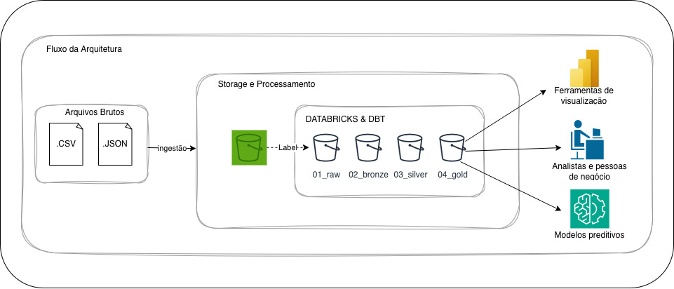
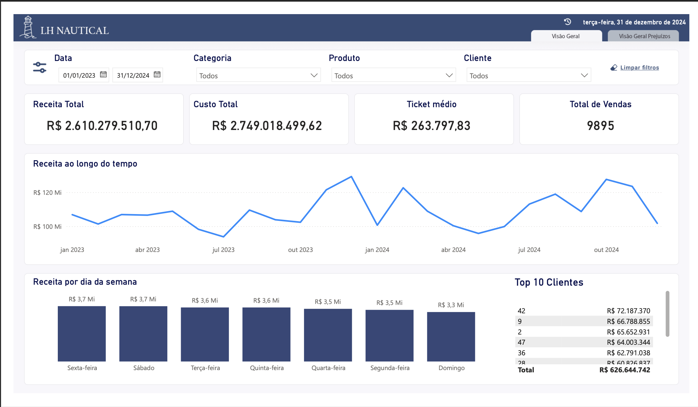
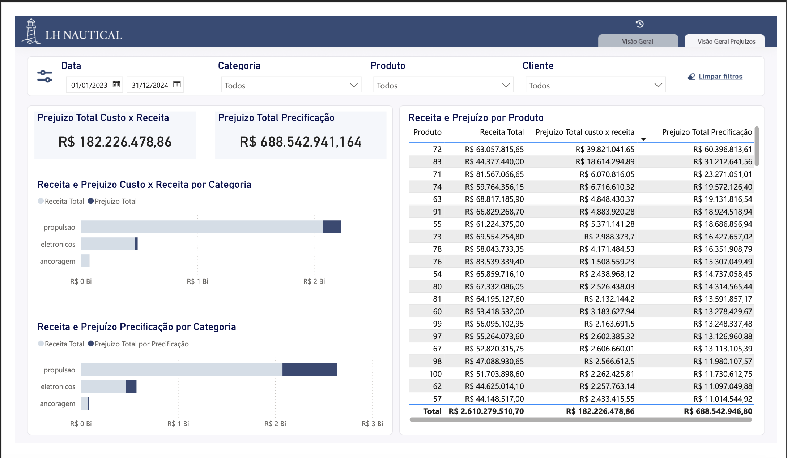

# 📊 LH Nautical — Data Analytics Project

## 📌 Visão Geral

Este projeto foi desenvolvido com foco em Analytics Engineering, com o objetivo de estruturar um pipeline completo de dados capaz de transformar dados brutos em informações confiáveis para análise e tomada de decisão.

O projeto simula um cenário real da empresa LH Nautical, que enfrentava problemas de qualidade de dados e tomava decisões baseadas em “feeling”.

---

## 🧱 Arquitetura do Projeto



O pipeline foi construído utilizando o conceito de Data Lakehouse com arquitetura Medallion (Raw, Bronze, Silver e Gold).

### Tecnologias utilizadas

- Databricks (Delta Lake) — processamento e armazenamento  
- dbt — transformação e modelagem analítica  
- AWS S3 (conceitual) — camada Raw  
- Power BI — visualização  
- GitHub — versionamento  

---

## 🔄 Fluxo de Dados

### 1. Raw
- Ingestão de arquivos CSV e JSON  
- Dados armazenados sem transformação  

### 2. Bronze
- Limpeza técnica  
- Padronização de colunas e tipos  
- Normalização de JSON  
- Remoção de duplicidades  

### 3. Silver
- Tratamento de dados inválidos  
- Padronização de textos  
- Deduplicação  
- Aplicação de regras técnicas  

### 4. Gold
- Modelo dimensional (Star Schema)  
- Criação de tabelas fato e dimensões  
- Aplicação de regras de negócio (custo, prejuízo, câmbio)  

---

## 📊 Modelo de Dados

### Fato

### Fato

- **fct_vendas** (grão: 1 linha por venda)

  - sale_id  
  - customer_id  
  - product_id  
  - sale_date  
  - quantity  

  - receita_transacao_brl  
  - custo_unitario_brl  
  - custo_total_brl  

  - prejuizo_brl  
  - teve_prejuizo  

### Dimensões

- dim_cliente  
- dim_produto  
- dim_data  

### Marts analíticos

- fct_prejuizo_produto  
- mart_clientes_fieis  
- mart_categoria_top10_clientes  

---

## 📊 Insights de Negócio

### 🧹 Inconsistência de categorias distorce análises

Durante a normalização dos produtos, foram identificadas diversas variações:

- Eletrunicos, Eletronicoz, E L E T R Ô N I C O S  
- Prop, Propulçao, Propução  

Após tratamento, as categorias foram consolidadas corretamente em:

- eletrônicos  
- propulsão  
- ancoragem  

**Impacto:** garantiu consistência analítica e viabilizou análises confiáveis de comportamento de compra.

---

### 💸 Prejuízo real por falha de precificação

Foi identificado que produtos estavam sendo vendidos abaixo do custo real.

O cálculo considerou:

- preço de venda (BRL)  
- custo histórico (USD)  
- câmbio da data da venda  

Como o câmbio não cobre todos os dias, foi aplicada a regra de:

**última cotação válida anterior à data da venda**

**Impacto:**

- identificação de prejuízo real  
- evidência de falha de precificação  
- suporte direto à tomada de decisão  

---

### 📅 Dias sem venda distorcem análises

A análise mostrou que considerar apenas dias com vendas gera médias infladas.

**Solução aplicada:**

- criação de dimensão de datas  
- inclusão de dias com venda = 0  

**Impacto:** correção da análise de desempenho por dia da semana.

---

### 🧠 Limitações do modelo de recomendação

O modelo baseado em coocorrência:

- identifica padrões de compra  
- mas não considera contexto adicional  

Limitações:

- não considera ordem temporal  
- não considera quantidade  
- não considera perfil do cliente  
- baixa confiabilidade para produtos com poucas compras  

---

## 📊 Dashboard

O projeto inclui um dashboard em Power BI com:



- Receita ao longo do tempo  
- Ticket médio  
- Volume de vendas  
- Análise por cliente  

---

### 💸 Análise de Prejuízo



Essa visão evidencia os principais problemas de precificação, permitindo identificar produtos com maior impacto financeiro negativo, tanto em valor absoluto quanto proporcional.

---

## 🧪 Notebooks

Os notebooks seguem a evolução do projeto:

- Ingestão de dados  
- Transformações (Bronze)  
- Integração com API de câmbio  
- Cálculo de custos e prejuízo  
- Análises exploratórias  
- Resolução das questões de negócio  

---

## 📁 Estrutura do Projeto
## 📁 Estrutura do Projeto

```
📦 projeto
 ┣ 📂 dbt/           # Transformações e modelagem
 ┣ 📂 notebooks/     # Análises e etapas exploratórias
 ┣ 📂 data/          # Dados brutos
 ┣ 📂 docs/          # Documentação e relatórios
 ┣ 📂 powerbi/       # Dashboard
 ┗ 📂 imagens/       # Imagens utilizadas no README
```


---

## 🚀 Conclusão

O projeto resultou na construção de um pipeline completo, escalável e confiável, capaz de sustentar análises estratégicas e evoluções futuras como:

- previsão de demanda  
- recomendação de produtos  
- análises gerenciais avançadas  
